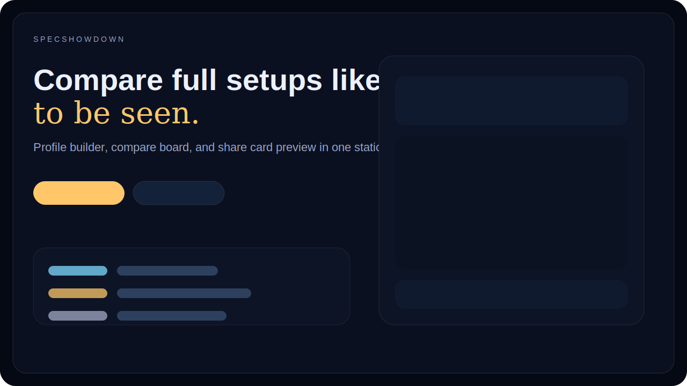
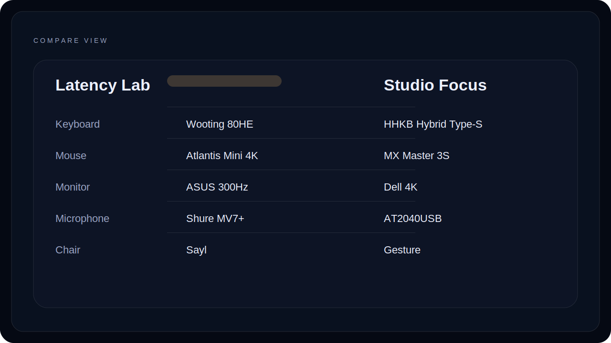

# SpecShowdown

SpecShowdown is a polished public web app for building setup profiles, turning them into beautiful shareable cards, and optionally comparing two hardware stacks side by side.




## English

### What it is

SpecShowdown helps people turn their desk, gaming, or creator setups into clean public summaries. Users can build profiles with categories like keyboard, mouse, controller, monitor, microphone, headphones, webcam, chair, and desk, then export a polished profile card or compare two profiles in minimal or detailed mode.

### Main features

- Create and edit setup profiles with a fast profile-card workflow
- Compare two profiles side by side
- Filter which categories appear in the comparison
- Switch between minimal and detailed compare views
- Generate a polished profile card preview
- Export the current summary as image, JSON, or text
- Save drafts in local storage
- Load built-in demo data for onboarding
- Switch the UI between English and Spanish
- Open public compare links through the URL hash without a backend

### Screenshots

Preview assets live in [docs/home-preview.svg](./docs/home-preview.svg) and [docs/compare-preview.svg](./docs/compare-preview.svg). Replace them with product screenshots once you capture the live app.

### Quick start

```bash
npm install
npm run dev
```

### Local development

```bash
npm run build
npm run preview
```

### Deployment

GitHub Pages is ready out of the box through `.github/workflows/deploy-pages.yml`.

1. Push the repository to GitHub.
2. Enable GitHub Pages and choose “GitHub Actions” as the source.
3. Push to `main` and let the workflow build and deploy `dist/`.

If you deploy somewhere else, build with `BASE_PATH=/ npm run build` or another host-specific base path.

### Roadmap ideas

- Import and export full libraries, not only active comparisons
- Optional backend for hosted public profile pages
- Preset templates for gaming, streaming, office, and creator desks
- Side-by-side diff highlighting for identical or upgraded components
- More card formats for different social platforms

### Repository details

- Suggested GitHub description: `Visual setup profiles and shareable hardware comparisons for desk, gaming, and creator rigs.`
- Suggested GitHub topics: `specshowdown`, `hardware-compare`, `setup-comparison`, `gaming-setup`, `desk-setup`, `webapp`, `vite`, `bilingual`

### Contribution guidelines

See [CONTRIBUTING.md](./CONTRIBUTING.md) for workflow, code standards, and recommended commit prefixes.

### Privacy and data handling

This first version is local-first. Drafts are stored in the browser through local storage. Data only leaves the device when a user exports files or manually shares a generated compare link.

### License

Released under the [MIT License](./LICENSE).

### Credits

- Product and design direction: Christopher David Alberto Roque (WhiteAssassins)
- Development and maintenance: AEWhite Devs
- Replace the package metadata, repository URLs, and contact emails before publishing the public repository

## Español

### Qué es

SpecShowdown es una app web pública y pulida para crear perfiles de setups, convertirlos en tarjetas visuales bonitas y, si quieres, comparar dos combinaciones de hardware lado a lado.

### Funciones principales

- Crear y editar perfiles de setup con un flujo centrado en la tarjeta de perfil
- Comparar dos perfiles lado a lado
- Filtrar categorías visibles en la comparación
- Alternar entre vista minimalista y detallada
- Generar una tarjeta de perfil visual lista para compartir
- Exportar el resumen actual como imagen, JSON o texto
- Guardar borradores en almacenamiento local
- Cargar datos demo integrados para onboarding
- Cambiar la interfaz entre inglés y español
- Abrir comparativas públicas desde la URL sin backend

### Capturas

Los previews del repositorio viven en [docs/home-preview.svg](./docs/home-preview.svg) y [docs/compare-preview.svg](./docs/compare-preview.svg). Puedes reemplazarlos por capturas reales cuando tengas la app desplegada.

### Inicio rápido

```bash
npm install
npm run dev
```

### Desarrollo local

```bash
npm run build
npm run preview
```

### Despliegue

GitHub Pages ya está preparado mediante `.github/workflows/deploy-pages.yml`.

1. Sube el repositorio a GitHub.
2. Activa GitHub Pages y elige “GitHub Actions” como origen.
3. Haz push a `main` y deja que el workflow compile y publique `dist/`.

Si despliegas en otro host, compila con `BASE_PATH=/ npm run build` o con la base que necesite tu plataforma.

### Ideas de roadmap

- Importar y exportar bibliotecas completas, no solo comparativas activas
- Backend opcional para páginas públicas alojadas
- Plantillas predefinidas para gaming, streaming, oficina y creator desks
- Resaltado visual de componentes iguales o mejorados
- Más formatos de tarjeta para distintas redes sociales

### Detalles del repositorio

- Descripción sugerida en GitHub: `Visual setup profiles and shareable hardware comparisons for desk, gaming, and creator rigs.`
- Topics sugeridos: `specshowdown`, `hardware-compare`, `setup-comparison`, `gaming-setup`, `desk-setup`, `webapp`, `vite`, `bilingual`

### Guía para contribuir

Consulta [CONTRIBUTING.md](./CONTRIBUTING.md) para ver el flujo de trabajo, estándares de código y prefijos recomendados para commits.

### Privacidad y manejo de datos

Esta primera versión es local-first. Los borradores se guardan en el navegador usando almacenamiento local. Los datos solo salen del dispositivo cuando la persona usuaria exporta archivos o comparte manualmente un enlace generado.

### Licencia

Publicado bajo la [Licencia MIT](./LICENSE).

### Créditos

- Dirección de producto y diseño: Christopher David Alberto Roque (WhiteAssassins)
- Desarrollo y mantenimiento: AEWhite Devs
- Reemplaza el metadata del paquete, las URLs del repositorio y los correos de contacto antes de publicar el repo
